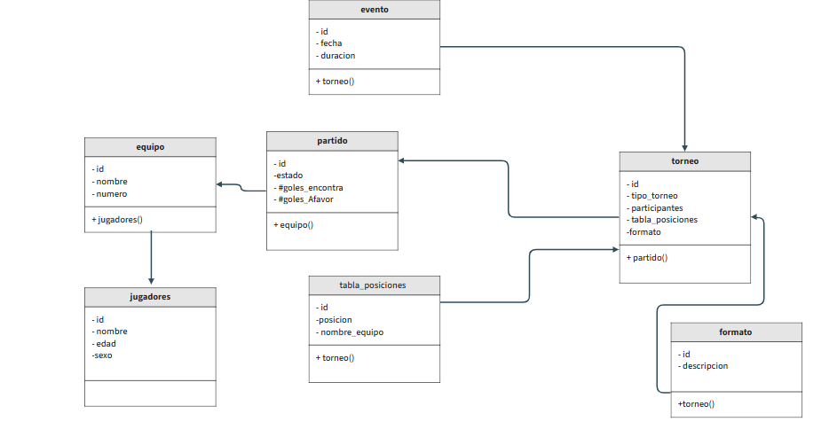

# Torneo  

**Programa en Node.js que permite gestionar un torneo de fútbol desde la consola.**
**Agregar, eliminar y modificar equipos.**
**Listar equipos.**
**Sortear semifinales (solo 4 equipos).**

# Decisiones de diseño

## Encapsulamiento:
**#nombre** de Equipo es privado para proteger la información.*

## Polimorfismo:
Eventoes clase base abstracta; SorteoEquiposimplementa ejecutarEvento().

## Mapa para equipos:
Permite acceso rápido por ID y manejo dinámico de los equipos.

## Sorteo de semifinales:
Solo se permite sortear si hay exactamente 4 equipos .
Mezcla aleatoriamente los equipos y genera 2 partidos.

# Cómo ejecutar el programa

Instalar Node.js
Desde la terminal, ubicarse en la carpeta del proyecto.
Ejecutar:
node main.js

# Siga las instrucciones del menú:

===  Torneo  ===
1. Agregar equipo
2. Eliminar equipo
3. Modificar equipo
4. Listar equipos
5. Sortear semifinales
6. Salir

# Pruebas manuales
**Flujo 1:** Agregar 4 equipos y clasificar semifinales

Agregar equipo → "Boca"
Agregar equipo → "Diamante"
Añadir equipo → "Hadas"
Agregar equipo → "Independiente"

Listar equipos → Verificar 4 equipos
Sortear semifinales → Muestra 2 partidos

# Ejemplo de salida:
Sorteo completado!
Partido 1: Diamante vs Boca
Partido 2: Hadas vs Independiente

# Intentar sorteo con menos de 4 equipos
Agregar equipo → "Boca"
Agregar equipo → "Hadas"

Sortear semifinales

Salida esperada: Se necesitan exactamente 4 equipos para semifinales

# Agregar nombre inválido

Agregar equipo → "" (vacío)

Salida esperada:  Nombre inválido